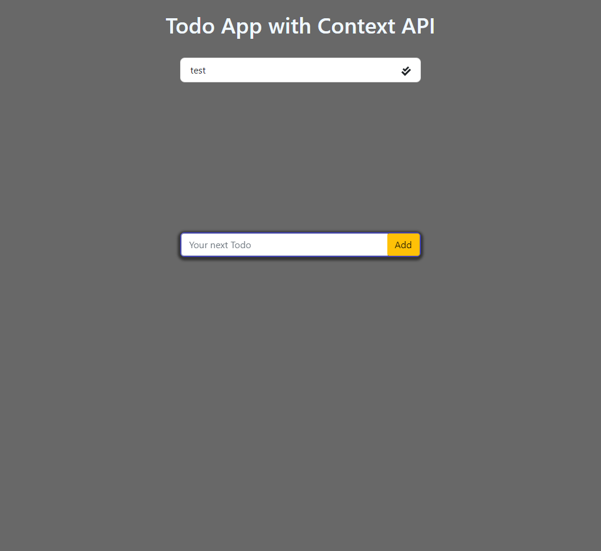

# Todo App

## Check out the Application Here : [Click Here](https://deepbaran.github.io/TodoApp/)

## This is a Todo Application built using React.js, React Hooks and Context API.

### This application is built using:

- React.js
- React Hooks
- Context API
- JSX

### Libraries used:

- [React Icons](https://www.npmjs.com/package/react-icons)
- [reactstrap](https://www.npmjs.com/package/reactstrap)
- [uuid](https://www.npmjs.com/package/uuid)

